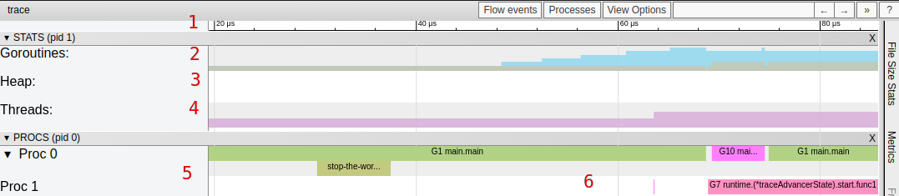
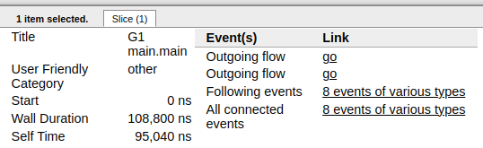

# golang跟踪剖析trace

- [Go Execution Tracer](https://docs.google.com/document/u/0/d/1FP5apqzBgr7ahCCgFO-yoVhk4YZrNIDNf9RybngBc14/pub?pli=1)
- [深入浅出Go语言执行跟踪](https://mp.weixin.qq.com/s?__biz=MzUxMDQxMDMyNg==&mid=2247484297&idx=1&sn=7a01fa4f454189fc3ccdb32a6e0d6897&scene=21#wechat_redirect)

该工具是Go 1.5版本加入的, 通过度量go语言特定事件的运行时, 例如：

- 创建, 启动和终止goroutines
- 阻塞/非阻塞goroutines(syscalls, channels, locks)
- 网络 I/O
- Syscalls
- 垃圾回收

## 1. Trace概览

```go
package main

import (
    "os"
    "runtime/trace"
)

func main() {
    trace.Start(os.Stderr)
    defer trace.Stop()
    // create new channel of type int
    ch := make(chan int)

    // start new anonymous goroutine
    go func() {
        // send 42 to channel
        ch <- 42
    }()
    // read from channel
    <-ch
}
```

执行`go run main.go 2> trace.out` 运行这段代码会发送trace数据到trace.out, 之后可以用`go tool trace trace.out`读取trace.启动一个web,默认是127.0.0.1地址的一个随机端口, 可以修改host进行指定.

## 2. 选项

- **View trace**: 最复杂、最强大和交互式的可视化显示了整个程序执行的时间轴.这个视图显示了在每个虚拟处理器上运行着什么, 以及什么是被阻塞等待运行的.稍后我们将在这篇文章中深入探讨这个视图.注意它只能在chrome上显示.

- **Goroutine analysis**: 显示了在整个执行过程中, 每种类型的goroutines是如何创建的.在选择一种类型之后就可以看到关于这种类型的goroutine的信息.例如, 在试图从mutex获取锁、从网络读取、运行等等每个goroutine被阻塞的时间.

- **Network/Sync/Syscall blocking profile**: 这些图表显示了goroutines在这些资源上所花费的时间.它们非常接近pprof上的内存/cpu分析.这是分析锁竞争的最佳选择.

- **Scheduler latency profiler**: 为调度器级别的信息提供计时功能, 显示调度在哪里最耗费时间.

### 2.1 View trace



1. Timeline: 显示执行的时间, 根据跟踪定位的不同, 时间单位可能会发生变化.你可以通过使用键盘快捷键(WASD键)来导航时间轴.
2. Goroutines: 在每个时间点显示有多少goroutines在运行, 有多少是可运行的(等待被调度的).大量可运行的goroutines可能显示调度竞争, 例如, 当程序创建过多的goroutines, 会导致调度程序繁忙.
3. Heap: 在执行期间显示内存分配, 这对于发现内存泄漏非常有用, 并检查垃圾回收在每次运行时能够释放多少内存.
4. OS Threads: 显示有多少OS线程正在被使用, 有多少个被syscalls阻塞.
5. Virtual Processors  
每个虚拟处理器显示一行.虚拟处理器的数量由`GOMAXPROCS`环境变量控制(默认为内核数).
6. Goroutines and events  
显示在每个虚拟处理器上有什么goroutine在运行.连接goroutines的连线代表事件.在示例图片中, 我们可以看到goroutine "G1.runtime.main"衍生出了两个不同的goroutines:G10和G7(前者是负责收集trace数据的goroutine, 后者是我们使用"go"关键字启动的那个).每个处理器的第二行可能显示额外的事件, 比如syscalls和运行时事件.这还包括goroutine代表运行时所做的一些工作(例如辅助垃圾回收).下图显示了当选择一个goroutine时得到的信息.



该信息包含：

- 它的"名称"(Title)
- 何时开始(Start)
- 持续时间(Wall Duration)
- 开始时的栈trace
- 结束时的栈trace
- 该goroutine产生的事件