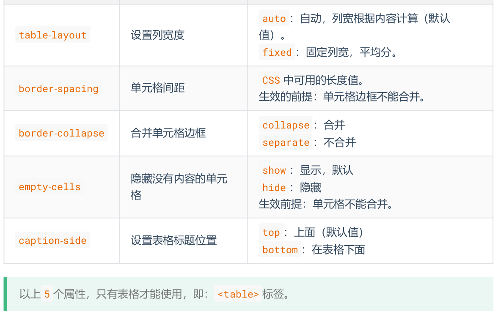
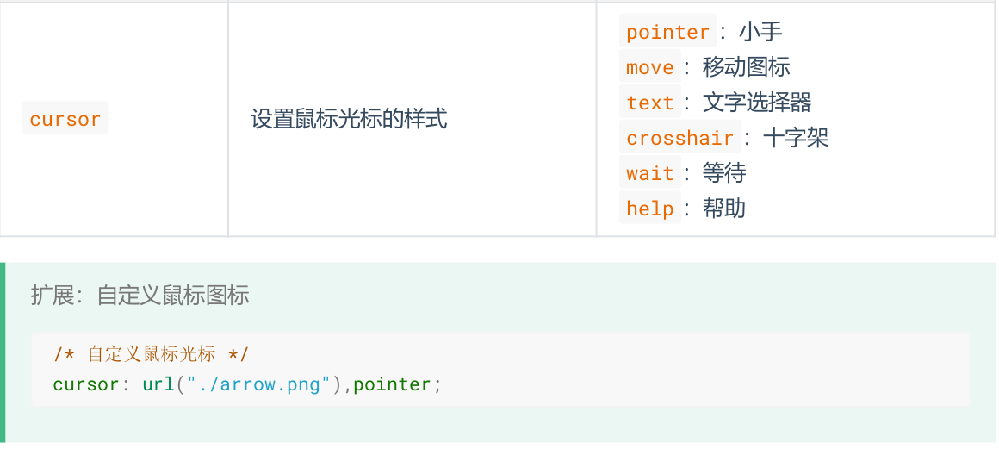

# css选择器

- [css选择器](#css选择器)
  - [1. 基本选择器](#1-基本选择器)
    - [1.1 通配选择器](#11-通配选择器)
    - [1.2 元素选择器](#12-元素选择器)
    - [1.3. 类选择器](#13-类选择器)
    - [1.4. ID选择器](#14-id选择器)
  - [2. 复合选择器](#2-复合选择器)
    - [2.1 交集选择器](#21-交集选择器)
    - [2.2 并集选择器](#22-并集选择器)
    - [2.3. 后代选择器](#23-后代选择器)
    - [2.4. 子代选择器](#24-子代选择器)
    - [2.5. 相邻兄弟选择器](#25-相邻兄弟选择器)
    - [2.6. 属性选择器](#26-属性选择器)
      - [2.6.1. 简单属性选择](#261-简单属性选择)
      - [2.6.2. 根据具体属性值选择](#262-根据具体属性值选择)
    - [2.7. 伪类](#27-伪类)
      - [2.7.1. 锚伪类](#271-锚伪类)
      - [2.7.2. 结构伪类](#272-结构伪类)
    - [2.8. 伪元素](#28-伪元素)
      - [2.8.1. `"first-line"`伪元素](#281-first-line伪元素)
      - [2.8.2. `:first-letter`伪元素](#282-first-letter伪元素)
      - [2.8.3. `:before`伪元素](#283-before伪元素)
      - [2.8.4. `after`伪元素](#284-after伪元素)
  - [3. 选择器权重](#3-选择器权重)
  - [4. CSS三大特性](#4-css三大特性)
    - [4.1. 层叠性](#41-层叠性)
    - [4.2 继承性](#42-继承性)
    - [4.3 优先级](#43-优先级)
  - [5. CSS常用属性](#5-css常用属性)
    - [5.1 颜色](#51-颜色)
      - [5.1.1 rgb/rgba](#511-rgbrgba)
      - [5.1.2 HEX/HEXA](#512-hexhexa)
      - [5.1.3 HSL/HSLA](#513-hslhsla)
    - [5.2 字体属性](#52-字体属性)
      - [5.2.1 字体大小](#521-字体大小)
      - [5.2.2 字体族](#522-字体族)
      - [5.2.3 字体风格](#523-字体风格)
      - [5.2.4 字体粗细](#524-字体粗细)
      - [5.2.5 字体复合写法](#525-字体复合写法)
    - [5.3 文本属性](#53-文本属性)
      - [5.3.1 文本颜色](#531-文本颜色)
      - [5.3.2 文本间距](#532-文本间距)
      - [5.3.3 文本修饰](#533-文本修饰)
      - [5.3.4 文本缩进](#534-文本缩进)
      - [5.3.5 文本水平对齐](#535-文本水平对齐)
      - [5.3.6 文本垂直对齐](#536-文本垂直对齐)
      - [5.3.7 行高](#537-行高)
      - [5.3.7 vertical-align](#537-vertical-align)
    - [5.4 列表属性](#54-列表属性)
    - [5.5 边框属性](#55-边框属性)
    - [5.6 表格属性](#56-表格属性)
    - [5.7 背景属性](#57-背景属性)
    - [5.7鼠标属性](#57鼠标属性)


## 1. 基本选择器

### 1.1 通配选择器

```css
/* 选中所有元素 */
* {
  color: orange;
  font-size: 40px;
}
```

### 1.2 元素选择器

文档的元素就是元素选择器,是最基本的选择器

```css
html { color:black; }
h1 { color:blue; }
h2 { color:silver; }
```

### 1.3. 类选择器

类选择器允许以一种独立于文档元素的方式来指定样式.

```html
<h1 class="important">
This heading is very important.
</h1>
```

```css
.important {color:red;}
```

### 1.4. ID选择器

ID选择器允许以一种独立于文档元素的方式来指定样式

```html
<p id="intro">This is a paragraph of introduction.</p>
```

```css
#intro {font-weight:bold;}
```

## 2. 复合选择器

### 2.1 交集选择器

选中同时符合多个条件的元素

```css
/* 选中:类名为beauty的p元素, 为此种写法用的非常多!!!! */
p.beauty {
  color: blue;
}
/* 选中:类名包含rich和beauty的元素 */
.rich.beauty {
  color: green;
}
```

### 2.2 并集选择器

选中多个选择器对应的元素(`以','分隔`), 被分组的选择器就可以分享相同的声明, 又称:分组选择器

```css
h1,
h2,
h3,
h4,
h5,
h6 {
  color: green;
}
```

### 2.3. 后代选择器

后代选择器可以选择作为某元素后代的元素(`以空格分隔`)

```css
h1 em {color:red;}
```

### 2.4. 子代选择器

与后代选择器相比, 子元素选择器只能选择作为某元素子元素的元素(`以>分隔`).

```css
h1 > strong {color:red;}
```

### 2.5. 相邻兄弟选择器

相邻兄弟选择器 (Adjacent sibling selector) 可选择**紧接**在另一元素后的元素, 且二者有相同父元素(`以+分隔`).

```css
h1 + p {margin-top:50px;}
```

### 2.6. 属性选择器

属性选择器可以根据元素的属性及属性值来选择元素.

#### 2.6.1. 简单属性选择

如果您希望把包含标题 (title) 的所有元素变为红色, 可以写作:

```css
*[title] {color:red;}  // 把包含标题 (title) 的所有元素变为红色
a[href] {color:red;} // 只对有 href 属性的锚 (a 元素) 应用样式
a[href][title] {color:red;} // 将同时有 href 和 title 属性的 HTML 超链接的文本设置为红色
img[alt] {border: 5px solid red;} // 所有带有 alt 属性的图像应用样式, 从而突出显示这些有效的图像
```

#### 2.6.2. 根据具体属性值选择

```css
a[href="http://www.w3school.com.cn/"][title="W3School"] {color: red;} // 把多个属性-值选择器链接在一起来选择一个文档
p[class="important warning"] {color: red;} // 根据具体属性值来选择该元素
```

| 选择器                                                       | 描述                                                         |
| :----------------------------------------------------------- | :----------------------------------------------------------- |
| [[*attribute*\]](https://www.w3school.com.cn/cssref/selector_attribute.asp) | 选取带有`attribute`属性的元素.                                |
| [[*attribute*=*value*\]](https://www.w3school.com.cn/cssref/selector_attribute_value.asp) | 选取`attribute`属性值为`value`的元素.                           |
| [[*attribute*~=*value*\]](https://www.w3school.com.cn/cssref/selector_attribute_value_contain.asp) | 选取`attribute`属性值中包含`value`的元素.                       |
| [[*attribute*\|=*value*\]](https://www.w3school.com.cn/cssref/selector_attribute_value_start.asp) | 选取`attribute`属性值等于`value`或`value`开头的元素, 该值必须是整个单词. |
| [[*attribute*^=*value*\]](https://www.w3school.com.cn/cssref/selector_attr_begin.asp) | 选取`attribute`属性值`value`开头的每个元素.                     |
| [[*attribute*$=value]](https://www.w3school.com.cn/cssref/selector_attr_end.asp) | 选取`attribute`属性值value结尾的每个元素.                     |
| [[attribute*=value]](https://www.w3school.com.cn/cssref/selector_attr_contain.asp) | 选取`attribute`属性值包含`value`的每个元素.                     |

### 2.7. 伪类

伪类用于向某些选择器添加特殊的效果

```css
selector : pseudo-class {property: value}
```

#### 2.7.1. 锚伪类

```css
a:link {color: #FF0000}    /* 未访问的元素 */
a:visited {color: #00FF00}  /* 已访问的元素 */
a:hover {color: #FF00FF}  /* 鼠标悬停在元素上 */
a:active {color: #0000FF}  /* 激活的元素 */
a:focus {color: #0000FF}  /* 获取焦点的元素 */
```

#### 2.7.2. 结构伪类

- `:first-child` 所有兄弟元素中的**第一个**.
- `:last-child` 所有兄弟元素中的**最后一个**.
- `:nth-child(n)` 所有兄弟元素中的**第 n 个**.
- `:first-of-type` 所有同类型兄弟元素中的**第一个**.
- `:last-of-type` 所有同类型兄弟元素中的**最后一个**.
- `:nth-of-type(n)` 所有同类型兄弟元素中的**第n个**.
- `:nth-last-child(n)` 所有兄弟元素中的**倒数第n个**.
- `:nth-last-of-type(n)` 所有同类型兄弟元素中的**倒数第n个**.
- `:only-child` 选择没有兄弟的元素 (独生子女).
- `:only-of-type` 选择没有**同类型**兄弟的元素.
- `:root` 根元素.
- `:empty` 内容为空元素 (空格也算内容).
- `:not(选择器)` 排除满足括号中条件的元素.
- `:checked` 被选中的复选框或单选按钮.
- `:enable` 可用的表单元素 (没有 `disabled` 属性).
- `:disabled` 不可用的表单元素 (有 `disabled` 属性)
- `:target` 选中锚点指向的元素.
- `:lang()` 根据指定的语言选择元素 (本质是看 lang 属性的值).

### 2.8. 伪元素

伪元素用于向某些选择器设置特殊效果

```css
selector:pseudo-element {property:value;}
```

#### 2.8.1. `"first-line"`伪元素

`"first-line"` 伪元素用于向文本的首行设置特殊样式.

```css
p:first-line  {
  color:#ff0000;
  font-variant:small-caps;
  }
```

**注释:**"first-line" 伪元素只能用于块级元素.

**注释:**下面的属性可应用于 "first-line" 伪元素:

- font
- color
- background
- word-spacing
- letter-spacing
- text-decoration
- vertical-align
- text-transform
- line-height
- clear

#### 2.8.2. `:first-letter`伪元素

`first-letter` 伪元素用于向文本的首字母设置特殊样式:

```css
p:first-letter
  {
  color:#ff0000;
  font-size:xx-large;
  }
```

**注释:**"first-letter" 伪元素只能用于块级元素.

**注释:**下面的属性可应用于 "first-letter" 伪元素:

- font
- color
- background
- margin
- padding
- border
- text-decoration
- vertical-align (仅当 float 为 none 时)
- text-transform
- line-height
- float
- clear

#### 2.8.3. `:before`伪元素

`:before`伪元素可以在元素的内容前面插入新内容

```css
h1:before{
  content:url(logo.gif);
  }
```

#### 2.8.4. `after`伪元素

`:after` 伪元素可以在元素的内容之后插入新内容.

```css
h1:after{
  content:url(logo.gif);
  }
```

| 属性                                                         | 描述                             | CSS  |
| :----------------------------------------------------------- | :------------------------------- | :--- |
| [:first-letter](https://www.w3school.com.cn/cssref/pr_pseudo_first-letter.asp) | 向文本的第一个字母添加特殊样式. | 1    |
| [:first-line](https://www.w3school.com.cn/cssref/pr_pseudo_first-line.asp) | 向文本的首行添加特殊样式.       | 1    |
| [:before](https://www.w3school.com.cn/cssref/pr_pseudo_before.asp) | 在元素之前添加内容.             | 2    |
| [:after](https://www.w3school.com.cn/cssref/pr_pseudo_after.asp) | 在元素之后添加内容.             | 2    |

## 3. 选择器权重

> 行内样式 > ID选择器 > 类选择器 > 元素选择器 > 通配选择器.

## 4. CSS三大特性

### 4.1. 层叠性

如果发生了样式冲突, 那就会根据一定的规则 (选择器优先级), 进行样式的层叠 (覆
盖).

### 4.2 继承性

元素会自动拥有其父元素、或其祖先元素上所设置的某些样式. 优先继承离得近的.

### 4.3 优先级

> `!important` > 行内样式 > ID选择器 > 类选择器 > 元素选择器 > * > 继承的样式

## 5. CSS常用属性

### 5.1 颜色

#### 5.1.1 rgb/rgba

```css
/* 使用 0~255 之间的数字表示一种颜色 */
color: rgb(255, 0, 0);/* 红色 */
color: rgb(0, 255, 0);/* 绿色 */
color: rgb(0, 0, 255);/* 蓝色 */
color: rgb(0, 0, 0);/* 黑色 */
color: rgb(255, 255, 255);/* 白色 */
/* 混合出任意一种颜色 */
color:rgb(138, 43, 226) /* 紫罗兰色 */
color:rgba(255, 0, 0, 0.5);/* 半透明的红色 */
/* 也可以使用百分比表示一种颜色 (用的少)  */
color: rgb(100%, 0%, 0%);/* 红色 */
color: rgba(100%, 0%, 0%,50%);/* 半透明的红色 */
```

#### 5.1.2 HEX/HEXA

```css
color: #ff0000;/* 红色 */
color: #00ff00;/* 绿色 */
color: #0000ff;/* 蓝色 */
color: #000000;/* 黑色 */
color: #ffffff;/* 白色 */
/* 如果每种颜色的两位都是相同的, 就可以简写*/
color: #ff9988;/* 可简为:#f98 */
/* 但要注意前三位简写了, 那么透明度就也要简写 */
color: #ff998866;/* 可简为:#f986 */
```

#### 5.1.3 HSL/HSLA

格式: `hsl(色相,饱和度,亮度)`/`hsla(色相,饱和度,亮度,透明度)`

### 5.2 字体属性

#### 5.2.1 字体大小

`font-size`控制字体的大小

```css
div {
  font-size: 40px;
}
```

#### 5.2.2 字体族

`font-family`控制字体类型

```css
div {
  font-family: "STCaiyun","Microsoft YaHei",sans-serif
}
```

#### 5.2.3 字体风格

`font-style`控制字体是否为斜体

```css
div {
  font-style: italic;
}
```

#### 5.2.4 字体粗细

`font-weight`控制字体的粗细

- `lighter`:细
- `normal`: 正常
- `bold`:粗
- `bolder`:很粗

```css
div {
  font-weight: bold;
}
div {
  font-weight: 600;
}
```

#### 5.2.5 字体复合写法

字体大小、字体族必须都写上, 字体族必须是最后一位、字体大小必须是倒数第二位.各个属性间用空格隔开.

```css
div {
  font: 20px "STCaiyun","Microsoft YaHei",sans-serif;
}
```

### 5.3 文本属性

#### 5.3.1 文本颜色

`color`控制文字的颜色

```css
p {
  color: rgb(112,45,78);
}
```

#### 5.3.2 文本间距

- 字母间距: `letter-spacing`
- 单词间距: `word-spacing` (通过空格识别词)
- 属性值为像素 (`px`) , 正值让间距增大, 负值让间距缩小

#### 5.3.3 文本修饰

`text-decoration`控制文本的各种装饰线, 可选值:

- `none`: 无装饰线 (常用)
- `underline`:下划线 (常用)
- `overline`: 上划线
- `line-through`: 删除线

#### 5.3.4 文本缩进

`text-indent`控制文本首字母的缩进.

```css
div {
  text-indent:40px;
}
```

#### 5.3.5 文本水平对齐

`text-align`控制文本的水平对齐方式:

- `left`: 左对齐 (默认值)
- `right`: 右对齐
- `center`: 居中对齐

```css
div {
  text-align: center;
}
```

#### 5.3.6 文本垂直对齐

顶部:无需任何属性, 在垂直方向上, 默认就是顶部对齐
居中:对于单行文字, 让 `height = line-height` 即可

#### 5.3.7 行高

`line-height`控制一行文字的高度.

```css
div {
  line-height: 60px;
  line-height: 1.5; /* 参考自身 font-size 的倍数 */
  line-height: 150%; /* 参考自身 font-size 的百分比 */
}
```

#### 5.3.7 vertical-align

`vertical-align`用于指定同一行元素之间, 或 表格单元格 内文字的 垂直对齐方式, 不能控制块元素.

- `baseline`  (默认值) :使元素的基线与父元素的基线对齐.
- `top`:使元素的顶部与其所在行的顶部对齐.
- `middle`:使元素的中部与父元素的基线加上父元素字母 x 的一半对齐.
- `bottom`:使元素的底部与其所在行的底部对齐.

### 5.4 列表属性

列表相关的属性, 可以作用在 `ul` 、 `ol` 、 `li` 元素上.

`list-style-type`设置列表符号

- `none`:不显示前面的标识 (很常用!)
- `square`:实心方块
- `disc`:圆形
- `decimal`:数字
- `lower-roman`:小写罗马字
- `upper-roman`:大写罗马字
- `lower-alpha`:小写字母
- `upper-alpha`:大写字母

`list-style-position`设置列表符号的位置

- `inside`:在 `li` 的里面
- `outside`:在 `li` 的外边

`list-style-image`自定义列表符号, `url(图片地址)`
`list-style`复合属性, 没有数量、顺序的要求

### 5.5 边框属性

`border-width`边框宽度CSS 中可用的长度值
`border-color`边框颜色CSS 中可用的颜色值
`border-style`边框风格

- `none` 默认值
- `solid` 实线
- `dashed` 虚线
- `dotted` 点线
- `double` 双实线

`border`边框复合属性, 没有数量、顺序的要求

### 5.6 表格属性



### 5.7 背景属性


### 5.7鼠标属性


