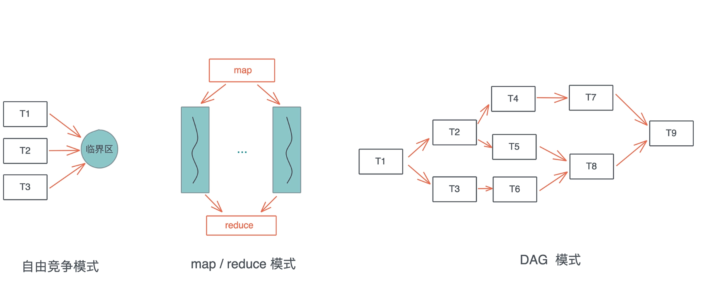
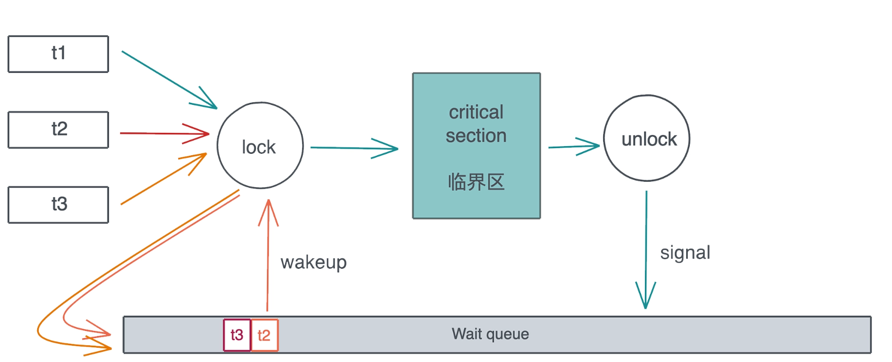
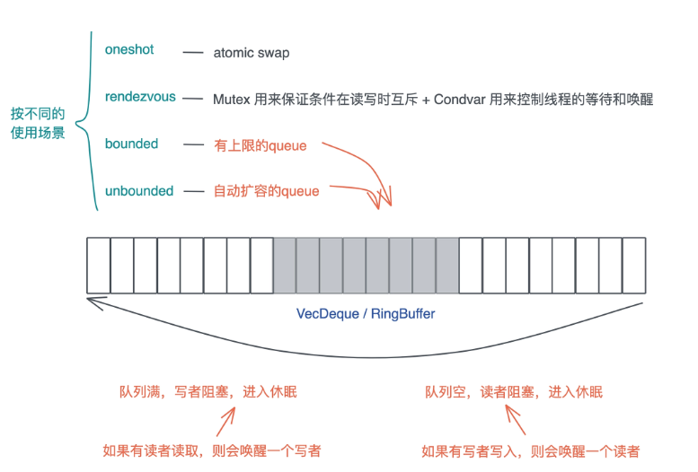

# 无畏并发

- `Concurrent`: 程序的不同部分之间独立的运行, 同时处理很多事情的能力.
- `Parallel`: 程序的不同部分同时运行, 同时执行很多事情的手段.

## 1. `Sync`和`Send` trait

```rust
pub unsafe auto trait Send {}
pub unsafe auto trait Sync {}
```

这两个`trait`(`std::marker::Sync`和`std::marker::Send`)都是 `unsafe auto trait`,  `auto` 意味着编译器会在合适的场合, 自动为数据结构添加它们的实现,  而 `unsafe` 代表实现的这个 `trait` 可能会违背 `Rust` 的内存安全准则,  如果开发者手工实现这两个 `trait`, 要自己为它们的安全性负责.

`Send/Sync` 是 `Rust` 并发安全的基础:

- `Send`: 允许线程间**转移所有权**, `Rc<T>`没有实现`Send`,它只用于单线程的情景.

  - 任何完全由`Send`类型组成的类型也被标记为`Send`
  - 除了原始指针之外,几乎所有的基础类型都是实现了`Send`

- `Sync`: 允许从**多线程访问**.

  - 实现了`Sync`的类型可以安全的被多个线程引用
  - 如果`T`是`Sync`,那`&T`就是`Send`, 引用可以被安全的送往另一个线程.

- 手动来实现`Send`和`Sync`是很难保证安全的,需要很谨慎的使用`unsafe`代码.

  - 如果一个类型 `T` 实现了 `Send trait`,  意味着 `T` 可以安全地从一个线程移动到另一个线程,  也就是说所有权可以在线程间移动.

  - 如果一个类型 `T` 实现了 `Sync trait`,  则意味着 `&T` 可以安全地在多个线程中共享. 一个类型 `T` 满足 `Sync trait`,  当且仅当 `&T` 满足 `Send trait`.

对于 `Send/Sync` 在线程安全中的作用,  可以这么看, **如果一个类型 `T: Send`, 那么 `T` 在某个线程中的独占访问是线程安全的；如果一个类型 `T: Sync`, 那么 `T` 在线程间的只读共享是安全的.**

对于我们自己定义的数据结构,  如果其内部的所有域都实现了 `Send` / `Sync`,  那么这个数据结构会被自动添加 `Send` / `Sync`.

标准库中, 不支持 `Send` / `Sync` 的数据结构主要有:

- 裸指针 `*const T` /`*mut T`. 它们是不安全的,  所以既不是 `Send` 也不是 `Sync`.
- `UnsafeCell` 不支持 `Sync`. 也就是说,  任何使用了 `Cell` 或者 `RefCell` 的数据结构不支持 `Sync`.
- 引用计数 `Rc` 不支持 `Send` 也不支持 `Sync`. 所以 `Rc` 无法跨线程.

## 2. 并发常见工作模式



- **自由竞争模式**下, 多个并发任务会竞争同一个临界区的访问权
- **map/reduce 模式**, 把工作打散, 按照相同的处理完成后, 再按照一定的顺序将结果组织起来
- **DAG 模式**, 把工作切成不相交的、有依赖关系的子任务, 然后按依赖关系并发执行.

## 3. Atomic

`Atomic`是所有并发原语的基础, 它为并发任务的同步奠定了坚实的基础.可以通过一条指令读取某个内存地址, 判断其值是否等于某个前置值, 如果相等, 将其修改为新的值. 这就是 `Compare-and-swap` 操作, 简称[`CAS`](https://en.wikipedia.org/wiki/Compare-and-swap)

```rust
pub fn compare_exchange(
    &self,
    current: bool,
    new: bool,
    success: Ordering,
    failure: Ordering
) -> Result<bool, bool>

pub enum Ordering {
    Relaxed,
    Release,
    Acquire,
    AcqRel,
    SeqCst,
}
```

可以看到 `compare_exchange`函数有两个和`Ordering`的奇怪参数, [`Ordering`](https://doc.rust-lang.org/std/sync/atomic/enum.Ordering.html)是一个 `enum`.

- `Relaxed` : 最宽松的规则, 它对编译器和CPU不做任何限制, 可以乱序执行.
- `Release`, 当我们**写入数据**时, 那么
  - 对于当前线程, 任何读取或写入操作都不能被乱序排在这个 store 之后.
  - 对于其它线程, 任何使用了`Acquire`来读取这个`atomic`的数据, 那么它们看到的是修改后的结果.
- `Acquire`, 当我们**读取数据**时, 那么
  - 对于当前线程, 任何读取或者写入操作都不能被乱序排在这个读取之前.
  - 对于其它线程, 如果使用了 `Release` 来修改数据, 那么, 修改的值对当前线程可见.
- `AcqRel`是`Acquire`和`Release`的结合, 同时拥有`Acquire`和`Release`的保证. 这个一般用在 `fetch_xxx` 上, 比如你要对一个`atomic`自增1, 你希望这个操作之前和之后的读取或写入操作不会被乱序, 并且操作的结果对其它线程可见.
- `SeqCst` 是最严格的`Ordering`,除了`AcqRel`的保证外,它还保证所有线程看到的所有`SeqCst`操作的顺序是一致的.

```rust
while self
    .locked
    .compare_exchange(false, true, Ordering::Acquire, Ordering::Relaxed)
    .is_err()
{
    // 性能优化: compare_exchange 需要独占访问, 当拿不到锁时, 我们
    // 先不停检测 locked 的状态, 直到其 unlocked 后, 再尝试拿锁
    while self.locked.load(Ordering::Relaxed) == true {}
}
```

> 注意, 我们在 `while loop` 里, 又嵌入了一个 `loop`. 这是因为 `CAS` 是个代价比较高的操作, 它需要获得对应内存的独占访问 (`exclusive access`) , 我们希望失败的时候只是简单读取 atomic 的状态, 只有符合条件的时候再去做独占访问, 进行 `CAS`. 所以, 看上去多做了一层循环, 实际代码的效率更高.

## 4. Mutex

`SpinLock`, 顾名思义,就是线程通过**CPU 空转**(`spin`, 就像前面的 while loop)忙等 (busy wait) , 来等待某个临界区可用的一种锁. 这种通过 `SpinLock`做互斥的实现方式有使用场景的限制: 如果受保护的临界区太大, 那么整体的性能会急剧下降,  CPU 忙等, 浪费资源还不干实事, 不适合作为一种通用的处理方法.

通用的解决方案是: 当多个线程竞争同一个 `Mutex` 时, 获得锁的线程得到临界区的访问, 其它线程被挂起, 放入该 `Mutex` 上的一个等待队列里. 当获得锁的线程完成工作, 退出临界区时, `Mutex` 会给等待队列发一个信号, 把队列中第一个线程唤醒, 于是这个线程可以进行后续的访问. 整个过程如下:



当然, 这样实现会带来公平性的问题: 如果新来的线程恰巧在 `spin` 过程中拿到了锁, 而当前等待队列中还有其它线程在等待锁, 那么等待的线程只能继续等待下去, 这不符合 `FIFO`, 不适合那些需要严格按先来后到排队的使用场景. 为此, [`parking_lot`](https://github.com/Amanieu/parking_lot) 提供了 `fair mutex`.

## 5. Condvar

操作系统还提供了 `Condvar`. `Condvar` 有两种状态:

- 等待 (wait) : 线程在队列中等待, 直到满足某个条件.
- 通知 (notify) : 当`condvar`的条件满足时, 当前线程通知其他等待的线程可以被唤醒. 通知可以是单个通知, 也可以是多个通知, 甚至广播 (通知所有人).

## 6. Channel

`Channel` 把锁封装在了队列写入和读取的小块区域内, 然后把读者和写者完全分离, 使得读者读取数据和写者写入数据, 对开发者而言, 除了潜在的上下文切换外, 完全和锁无关, 就像访问一个本地队列一样. 所以, 对于大部分并发问题, 我们都可以用 `Channel` 或者类似的思想来处理 (比如 actor model).

`Rust`提供了以下四种`Channel`:

- `oneshot`: 这可能是最简单的 `Channel`, 写者就只发一次数据, 而读者也只读一次. 这种一次性的、多个线程间的同步可以用 `oneshot channel` 完成. 由于 `oneshot` 特殊的用途, 实现的时候可以直接用 `atomic swap` 来完成

- `rendezvous`: 很多时候, 我们只需要通过 `Channel` 来控制线程间的同步, 并不需要发送数据. `rendezvous channel` 是 `channel size` 为 **0** 的一种特殊情况.
- `bounded`: `bounded channel` 有一个队列, 但队列有上限. 一旦队列被写满了, 写者也需要被挂起等待. 当阻塞发生后, 读者一旦读取数据, `channel` 内部就会使用 `Condvar` 的 `notify_one` 通知写者, 唤醒某个写者使其能够继续写入.
- `unbounded`: `queue` 没有上限, 如果写满了, 就自动扩容. 我们知道, `Rust` 的很多数据结构如 `Vec` 、`VecDeque` 都是自动扩容的. `unbounded` 和 `bounded` 相比, 除了不阻塞写者, 其它实现都很类似.



根据 `Channel` 读者和写者的数量, `Channel` 又可以分为:

- `SPSC`: Single-Producer Single-Consumer, 单生产者, 单消费者. 最简单, 可以不依赖于 `Mutex`, 只用 `atomics` 就可以实现.
- `SPMC`: Single-Producer Multi-Consumer, 单生产者, 多消费者. 需要在消费者这侧读取时加锁.
- `MPSC`: Multi-Producer Single-Consumer, 多生产者, 单消费者. 需要在生产者这侧写入时加锁.
- `MPMC`: Multi-Producer Multi-Consumer. 多生产者, 多消费者. 需要在生产者写入或者消费者读取时加锁.

## 7. Actor

[`actor model`](https://en.wikipedia.org/wiki/Actor_model), `actor` 是一种有栈协程. 每个 `actor`, 有自己的一个独立的、轻量级的调用栈, 以及一个用来接受消息的消息队列 (`mailbox` 或者 `message queue`) , 外界跟 `actor` 打交道的唯一手段就是, 给它发送消息.

## 9. 参考

- Robe Pike 的演讲 [concurrency is not parallelism](https://go.dev/blog/waza-talk)
- Jon Gjengset 的视频: [Crust of Rust: Atomics and Memory Ordering](https://www.youtube.com/watch?v=rMGWeSjctlY)
- Rust 的 [spin-rs crate](https://github.com/mvdnes/spin-rs) 提供了 `Spinlock` 的实现
- [atcix](https://github.com/actix/actix) actor 实现
- [bastion](https://github.com/bastion-rs/bastion) actor 实现
- concurrent hash map: [dashmap](https://github.com/xacrimon/dashmap) , [left-right](https://github.com/jonhoo/left-right)
