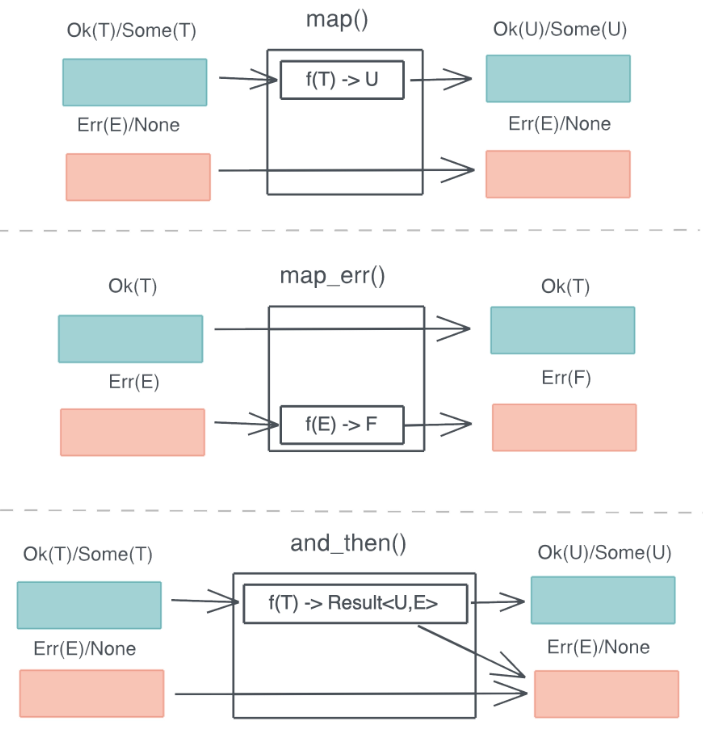

# 错误处理

## 1. Option 和 Result

`Option` 是一个 `enum`, 它可以承载有值 / 无值这种最简单的错误类型. 

其定义如下:

```rust
pub enum Option<T> {
    None,
    Some(T),

```

`Result` 是一个更加复杂的 `enum`, 当函数出错时, 可以返回 Err(E), 否则 Ok(T).

其定义如下: 

```rust
#[must_use = "this `Result` may be an `Err` variant, which should be handled"]
pub enum Result<T, E> {
    Ok(T),
    Err(E),
}
```

## 2. ? 操作符

好在 `Rust` 除了有强大的类型系统外, 还具备元编程的能力, 所以在 `Rust` 代码中, 如果你只想传播错误, 不想就地处理, 可以用 `?` 操作符.

`?` 操作符内部被展开成类似下面的代码:

```rust
match result {
  Ok(v) => v,
  Err(e) => return Err(e.into())
}
```

在不同的错误类型之间是无法直接使用的, 注意上面的 `e.into()`, 需要实现 `From trait` 在二者之间建立起转换的桥梁

## 3. 函数式错误处理

`Rust` 还为 `Option` 和 `Result` 提供了大量的辅助函数, 如 `map` / `map_err` / `and_then`, 你可以很方便地处理数据结构中部分情况. 如下图所示: 




通过这些函数, 你可以很方便地对错误处理引入[Railroad oriented programming](https://www.slideshare.net/ScottWlaschin/railway-oriented-programming) 范式

## 4. panic! 和 catch_unwind

`panic!` 是不可恢复或者不想恢复的错误, 我们希望在此刻, 程序终止运行并得到崩溃信息.

`Rust` 标准库下提供了 `catch_unwind()` , 把调用栈回溯到 `catch_unwind` 这一刻你就可以把 `Rust` 代码整个封装在 `catch_unwind()` 函数所需要传入的闭包中. 这样, 一旦任何代码中, 包括第三方 `crates` 的代码, 含有能够导致 `panic!` 的代码, 都会被捕获, 并被转换为一个 `Result`. 

## 5. Error trait 和 错误的转换

为了规范这个代表错误的数据类型的行为, `Rust` 定义了 `Error trait`: 

```rust
pub trait Error: Debug + Display {
    fn source(&self) -> Option<&(dyn Error + 'static)> { ... }
    fn backtrace(&self) -> Option<&Backtrace> { ... }
    fn description(&self) -> &str { ... }
    fn cause(&self) -> Option<&dyn Error> { ... }
}
```

我们可以使用 [`thiserror`](https://github.com/dtolnay/thiserror)和 [`anyhow`](https://github.com/dtolnay/anyhow) 来简化这个步骤. `thiserror` 提供了一个派生宏` (derive macro) `来简化错误类型的定义.


